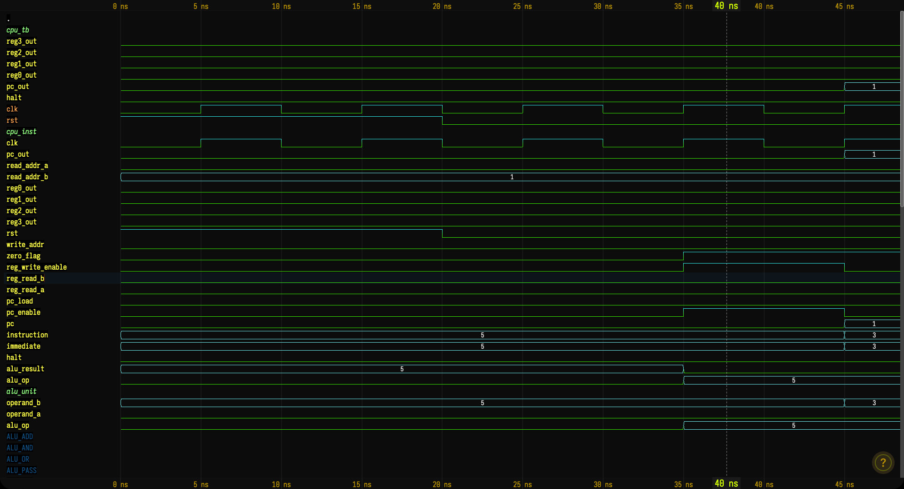

# Enhanced 8-Bit CPU Project

An enhanced 8‑bit CPU core with expanded instruction set, data memory, and advanced ALU operations. Originally based on a simple 4‑bit design, this version features a Harvard architecture with separate instruction and data memories, 8 registers, and comprehensive status flags. Uses plain Verilog, Icarus Verilog for simulation, and waveform viewers for analysis.

---

## Table of Contents

1. Project Overview
2. Quick Start (macOS / Linux)
3. What You’ll Learn
4. Project Layout
5. Installation
6. Running a Simulation
7. Viewing Waveforms
8. Example Output
9. CPU Architecture
10. Instruction Set
11. Editing the Demo Program
12. Makefile Targets
13. Troubleshooting
14. Ideas for Extensions
15. Next Steps

---

## Project Overview

This repo contains a minimal 4‑bit CPU with:

- a tiny instruction memory (ROM)
- a 4‑register file
- a basic ALU
- a simple control unit / state machine
- a testbench that drives everything and writes a VCD file

The goal isn’t to be fancy. It’s just enough logic to see how a CPU fetches, decodes, and executes a short program, and to give you something small you can comfortably read in one sitting.

---

## Quick Start

### Requirements

- macOS (Intel or Apple Silicon) or Linux
- Icarus Verilog (`iverilog`, `vvp`)
- Python 3
- Any modern web browser (for the HTML waveform viewer)

### Install Icarus Verilog

On macOS (Homebrew):

```bash
brew install icarus-verilog
```

On Debian/Ubuntu:

```bash
sudo apt-get update
sudo apt-get install iverilog
```

Check that things are on the path:

```bash
iverilog -v
python3 --version
```

---

## What You’ll Learn

Working through this repo you’ll touch:

- writing small, modular Verilog modules
- basic CPU datapath components (ALU, register file, program counter, control)
- simple finite‑state machines
- running simulations with Icarus Verilog
- reading VCD waveforms and correlating them with the program

It’s a good size project if you’re comfortable with basic logic gates and want to see how they add up to “a CPU”.

---

## Project Layout

```text
simple-cpu-project/
├── Makefile
├── README.md
│
├── rtl/                     # RTL design
│   ├── alu.v                # Enhanced 8-bit ALU with status flags
│   ├── register_file.v      # 8-register file (8-bit wide)
│   ├── program_counter.v    # 8-bit program counter
│   ├── instruction_memory.v # 256 x 16-bit instruction ROM
│   ├── data_memory.v        # 256 x 8-bit data RAM (Harvard architecture)
│   ├── control_unit.v       # Instruction decoder and control
│   └── cpu.v                # Top level CPU module
│
├── sim/
│   └── cpu_tb.v             # testbench
│
├── tools/
│   ├── vcd_viewer.py        # text/terminal VCD viewer
│   └── waveform_viewer.html # in‑browser VCD viewer
│
├── cpu_sim.vcd              # VCD written by the testbench (generated)
├── cpu_sim.vvp              # compiled simulation (generated)
└── sim.png                  # example waveform screenshot
```

---

## Installation

Clone or copy the project somewhere convenient, then from the project root:

```bash
cd simple-cpu-project
make help
```

If `make help` runs and prints the targets, your toolchain is probably set up correctly.

---

## Running a Simulation

From the project root:

```bash
make simulate
```

This compiles the RTL and testbench with `iverilog`, runs the simulation with `vvp`, and writes `cpu_sim.vcd`. The testbench also prints a short trace of the program as it executes.

You should see output along these lines (exact numbers may differ if you change the program):

```text
=================================================
    Enhanced 8-bit CPU Simulation
=================================================
Time(ns) | PC | Halt | R0 | R1 | R2 | R3 | R4 | R5 | R6 | R7 | Instruction
-------------------------------------------------
  26000 |   0 |   0  |   0 |   0 |   0 |   0 |   0 |   0 |   0 |   0 | 0205
  36000 |   1 |   0  |   0 |   5 |   0 |   0 |   0 |   0 |   0 |   0 | 040a
  66000 |   2 |   0  |   0 |   5 |  10 |   0 |   0 |   0 |   0 |   0 | 1280
  86000 |   3 |   0  |   0 |   5 |  15 |   0 |   0 |   0 |   0 |   0 | 2440
 106000 |   4 |   0  |   0 |  10 |  15 |   0 |   0 |   0 |   0 |   0 | 0632
 166000 |   7 |   0  |   0 |  10 |  15 |  50 |  10 |   0 |   0 |   0 | 3280
 226000 |  11 |   0  |   0 |  10 |  10 |  50 |  10 |  42 |   0 |   0 | f000
-------------------------------------------------
CPU HALTED at time 236000 ns
Final Register Values:
  R0 =   0, R1 =  10, R2 =  10, R3 =  50
  R4 =  10, R5 =  42, R6 =   0, R7 =   0
```

---

## Viewing Waveforms

There are a few options for looking at the VCD.

### 1. Web Viewer (HTML)

Opens a small in‑browser viewer from the `tools` directory:

```bash
make web-wave
```

Your default browser should open `tools/waveform_viewer.html`. Once it’s open:

- drag `cpu_sim.vcd` into the page
- select signals you care about (e.g. `clk`, `pc`, `halt`, register outputs)
- zoom and pan around the timeline

### 2. Terminal Viewer (Python)

For a quick text‑based summary:

```bash
make wave
```

This runs `tools/vcd_viewer.py` on `cpu_sim.vcd` and prints signal tables and a couple of simple ASCII “waveforms” directly in the terminal.

### 3. Other Tools

If you already have GTKWave or another VCD viewer installed, you can of course use that as well. The Makefile has a `gtkwave` target for convenience:

```bash
make gtkwave
```

On Apple Silicon, GTKWave can be finicky; the web viewer tends to be the least painful option.

---

## Example Waveform (sim.png)

The file `sim.png` was captured from a run of this testbench and shows one of the example programs executing. It’s roughly what you should see if you load `cpu_sim.vcd` into a waveform viewer right after cloning the repo and running `make simulate` once.

In short:

- the clock toggles throughout the run
- the program counter steps through addresses 0–7
- register `R0` walks through a few values as the arithmetic instructions execute
- the `halt` signal goes high on the HALT instruction and stays there

You can use this screenshot as a sanity check if your own waveforms look very different.



---

## CPU Architecture (High Level)

The CPU features an enhanced architecture:

- **8-bit datapath** - All registers, ALU, and data paths are 8 bits wide
- **8 general-purpose registers** (`R0`–`R7`) - Each 8 bits wide
- **Harvard architecture** - Separate instruction and data memories
  - Instruction memory: 256 locations × 16 bits (8-bit address, 16-bit instruction)
  - Data memory: 256 locations × 8 bits (8-bit address, 8-bit data)
- **8-bit program counter** - Supports up to 256 instruction addresses
- **Enhanced ALU** - 14 operations including arithmetic, logic, shifts, and comparisons
- **Status flags** - Zero, carry, overflow, and negative flags
- **16-bit instruction format** - Allows register addressing and immediate values
- **Control unit** - State machine-based instruction decoder and execution controller

Block diagram:

```text
┌─────────────────────────────────────────────────────────┐
│                    ENHANCED 8-BIT CPU                   │
│                                                          │
│  ┌──────────────┐                                        │
│  │   Program    │                                        │
│  │   Counter    │────┐                                   │
│  │   (8-bit)    │    │                                   │
│  └──────────────┘    │                                   │
│         ↑            ↓                                   │
│         │    ┌──────────────────┐                       │
│         │    │  Instruction     │                       │
│         │    │  Memory (ROM)    │                       │
│         │    │  256 × 16-bit    │                       │
│         │    └──────────────────┘                       │
│         │            │                                   │
│         │            ↓                                   │
│         │    ┌──────────────────┐                       │
│         └───→│   Control Unit   │                       │
│              │  (State Machine) │                       │
│              └──────────────────┘                       │
│                 │      │      │      │                  │
│      ┌──────────┘      │      │      └──────┐          │
│      ↓                 │      │             ↓          │
│  ┌──────────────┐      │      │     ┌──────────────┐  │
│  │   Register   │──────┼──────┼────→│     ALU      │  │
│  │    File      │      │      │     │  (14 ops +   │  │
│  │  8 × 8-bit   │      │      │     │  status flags│  │
│  └──────────────┘      │      │     └──────────────┘  │
│      ↑   │             │      │             │          │
│      │   └─────────────┘      │             │          │
│      │                        │             ↓          │
│      │                  ┌──────────────┐              │
│      └──────────────────│  Data Memory │              │
│                         │  (RAM)       │              │
│                         │  256 × 8-bit │              │
│                         └──────────────┘              │
└─────────────────────────────────────────────────────────┘
```

---

## Instruction Set

Each instruction is 8 bits: the upper 4 bits are the opcode, the lower 4 bits are an operand (immediate) or an address.

### Encoding

```text
[7:4] opcode
[3:0] operand/address
```

### Implemented Instructions

| Opcode | Mnemonic | Description                           | Example           |
|--------|----------|---------------------------------------|-------------------|
| 0000   | LOAD     | Load 4‑bit immediate into `R0`       | `0000_0101`       |
| 0010   | ADD      | `R0 ← R0 + R1`                       | `0010_0001`       |
| 0011   | SUB      | `R0 ← R0 - R1`                       | `0011_0010`       |
| 0100   | AND      | `R0 ← R0 & R1`                       | `0100_0001`       |
| 0101   | OR       | `R0 ← R0 | R1`                       | `0101_0001`       |
| 0110   | JUMP     | `PC ← address` (unconditional)       | `0110_0011`       |
| 0111   | HALT     | Stop execution                       | `0111_0000`       |
| 1000   | JZ       | Jump if last result was zero         | `1000_0111`       |
| 1001   | JNZ      | Jump if last result was non‑zero     | `1001_0111`       |

The control unit keeps a small latched copy of the ALU’s zero flag so that `JZ` / `JNZ` can make decisions based on the most recent arithmetic/logic instruction.

---

## The Demo Program

`rtl/instruction_memory.v` comes preloaded with an enhanced program that exercises arithmetic, memory operations, branches, and jumps. In table form:

```text
Address | Hex     | Assembly        | Effect
--------|---------|-----------------|-------------------------------
   0    | 0205    | LOADI R1, 5     | R1 = 5
   1    | 040a    | LOADI R2, 10    | R2 = 10
   2    | 1280    | ADD R1, R2      | R2 = R1 + R2 = 15
   3    | 2440    | SUB R2, R1      | R1 = R2 - R1 = 10
   4    | 0632    | LOADI R3, 50    | R3 = 50 (memory address)
   5    | 6232    | STORE R1, [50]  | Mem[50] = R1 = 10
   6    | 7832    | LOAD R4, [50]   | R4 = Mem[50] = 10
   7    | 3280    | AND R1, R2      | R2 = R1 & R2 = 10
   8    | a00a    | JUMP 10         | PC = 10
   9    | 0fff    | LOADI R5, 63    | skipped (max immediate)
  10    | 0a2a    | LOADI R5, 42    | R5 = 42
  11    | f000    | HALT            | stop
```

Expected final register state: `R0=0, R1=10, R2=10, R3=50, R4=10, R5=42, R6=0, R7=0`

This program demonstrates:
- Immediate loading into registers
- Arithmetic operations (ADD, SUB)
- Bitwise operations (AND)
- Memory operations (STORE, LOAD) using Harvard architecture
- Unconditional jumps
- Register addressing across 8 registers

---

## Editing the Program

To change the program, open `rtl/instruction_memory.v` and edit the `initial` block. Instructions use the 16-bit format: `{opcode[3:0], reg1[2:0], reg2[2:0], immediate[5:0]}`.

Example: A simple program that loads two values, adds them, and stores the result:

```verilog
memory[0]  = {4'b0000, 3'b001, 3'b000, 6'b000101};  // LOADI R1, 5
memory[1]  = {4'b0000, 3'b010, 3'b000, 6'b001010};  // LOADI R2, 10
memory[2]  = {4'b0001, 3'b001, 3'b010, 6'b000000};  // ADD R1, R2 -> R2 = 15
memory[3]  = {4'b0110, 3'b010, 3'b000, 6'b110010};  // STORE R2, [50]
memory[4]  = {4'b1111, 3'b000, 3'b000, 6'b000000};  // HALT
```

Then re‑run:

```bash
make simulate
make web-wave
```

You should see the new values reflected both in the terminal trace and in your waveforms.

**Important Notes:**
- Immediate values are limited to 6 bits (0-63)
- Memory addresses for STORE/LOAD are also limited to 6-bit immediates
- Register indices use 3 bits (0-7 for R0-R7)
- For arithmetic/logic operations, `reg2` is the destination register

---

## Makefile Targets

The main shortcuts live in the top‑level `Makefile`:

```text
make simulate   # compile and run the testbench, produce cpu_sim.vcd
make wave       # run the Python VCD viewer in the terminal
make web-wave   # open the HTML waveform viewer in your browser
make gtkwave    # (optional) open cpu_sim.vcd in GTKWave, if installed
make clean      # remove generated files
make help       # list available targets
```

If `make` isn’t available on your system, you can run the underlying commands manually:

```bash
iverilog -g2012 -o cpu_sim.vvp rtl/*.v sim/cpu_tb.v
vvp cpu_sim.vvp
python3 tools/vcd_viewer.py cpu_sim.vcd
```

---

## Troubleshooting

A few common things that tend to go wrong:

- **`iverilog: command not found`**: install Icarus Verilog using Homebrew or your distro’s package manager.
- **`python3: command not found`**: install Python 3 from your package manager or from python.org.
- **No `cpu_sim.vcd` after running `make simulate`**: check the console output for earlier compile errors.
- **Simulation never halts**: make sure your program contains a `HALT` instruction (`0111_0000`).
- **Web viewer opens but shows nothing**: drag `cpu_sim.vcd` into the page; the file isn’t loaded automatically.

If you’re really stuck, it’s often helpful to:

- temporarily shorten the program so you can focus on a couple of instructions
- watch `pc`, `instruction`, and `R0` in the waveforms and step through by hand

---

## Ideas for Extensions

Some low‑effort ways to push the design a bit further:

- add a couple more ALU ops (shift left/right, NOT)
- add a `JZ` / `JNZ` style conditional jump using the ALU’s zero flag
- separate data memory from instruction memory
- bump the datapath to 8 bits and resize the registers/ALU

And if you want a larger project:

- build a slightly richer instruction set
- try a tiny RISC‑style core
- port the whole thing to an FPGA dev board and blink some LEDs based on register contents

---

## Next Steps

If you’ve read through the RTL and are comfortable tweaking the instruction memory, you’ve already covered most of what this project is meant to show. From here, you can either grow this design or start something new (UART, FIFO, simple bus, etc.).

In any case, keep the VCDs and waveforms handy—being able to read them comfortably is one of the most useful habits you can build early on.
